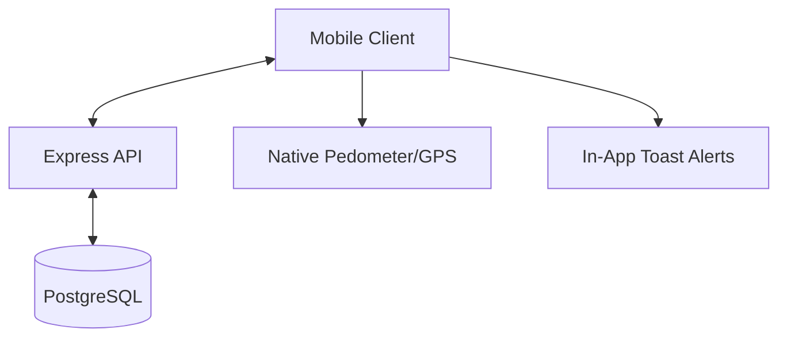

# Fitness Quest - Technical Design Document

## 1. Introduction
Fitness Quest is a gamified exercise app designed to build consistent habits through randomly scheduled "missions." It emphasizes small, achievable workouts over long gym sessions.

## 2. System Architecture

### 2.1 Overview
The system follows a standard Client-Server architecture with persistent storage and intelligent activity tracking.

*   **Client**: React Native / Expo with TypeScript.
*   **Server**: Node.js / Express with TypeScript.
*   **Database**: PostgreSQL (Production storage for Users, Groups, Missions, and XP history).
*   **ORM**: Prisma (For type-safe database access).
*   **Auth**: Passport.js with JWT and Social OAuth (Google/Facebook).
*   **Activity**: Native pedometer and movement tracking via `expo-sensors`.

### 2.2 Component Diagram

## 3. Core Functional Requirements

### 3.1 Exercise Scheduling & Mission Rotation
*   **Daily Reset**: At 00:00 local time, 3 new exercises are randomly selected.
*   **Refresh Mechanic**: 12-hour cooldown per refresh.
*   **Availability Brackets**: User-defined window (e.g., 09:00-18:00) split into 3 blocks.

### 3.2 Mission System
*   **Strict Brackets**: Missions not completed by the end of their bracket are marked as `MISSED`.
*   **Snooze**: Missions can be snoozed exactly once for a 15-minute extension.
*   **Intelligent Alerts**: In-app alerts are only triggered if the user has been stationary for 40+ minutes.

### 3.3 Gamification
*   **XP System**: Formula: `XP = (Exercises_Today * Days_Active) * (1 + (Current_Streak * 0.1))`.
*   **Streaks**:
    *   **Daily Streak**: Increments if at least 1 mission is completed per day.
    *   **Streak Reset**: If ALL 3 missions in a day are `MISSED`, Current Streak resets to 0.

### 3.4 Social & Community
*   **Groups**: Create/Join private groups for competitive leaderboards.
*   **Group Leaderboards**: Ranks based on XP earned *since the group's creation*.
*   **Sharing**: Share group status and app invitations via native system share sheet.

## 4. Data Model (PostgreSQL)

### 4.1 User
*   `id`: UUID (Primary Key)
*   `username`: String
*   `email`: String (Unique)
*   `password`: String (Hashed, optional)
*   `googleId`: String (Optional)
*   `facebookId`: String (Optional)
*   `startTime`: String (e.g., "09:00")
*   `endTime`: String (e.g., "18:00")
*   `totalXP`: Int
*   `currentStreak`: Int
*   `bestStreak`: Int

### 4.2 Group
*   `id`: UUID (Primary Key)
*   `name`: String
*   `ownerId`: UUID (Relation to User)
*   `createdAt`: DateTime

### 4.3 Mission
*   `id`: String
*   `userId`: UUID (Relation to User)
*   `exerciseId`: String
*   `status`: String (PENDING, COMPLETED, MISSED)
*   `bracketStart`: String
*   `bracketEnd`: String

## 5. Future Implementation: Pedometer & Media

### 5.1 Real Pedometer Integration
*   **Sensors**: Use `expo-sensors` (Pedometer) to track physical steps.
*   **Timer Reset**: If `deltaSteps > 0` within a 1-minute window, the 40-minute stationary timer resets to zero.

### 5.2 Instructional Media
*   **Step Guides**: Each exercise in the library will include a detailed `instructions: string[]` array.
*   **Visual Loops**: Integration of lightweight GIFs or video snippets to demonstrate proper exercise form.
