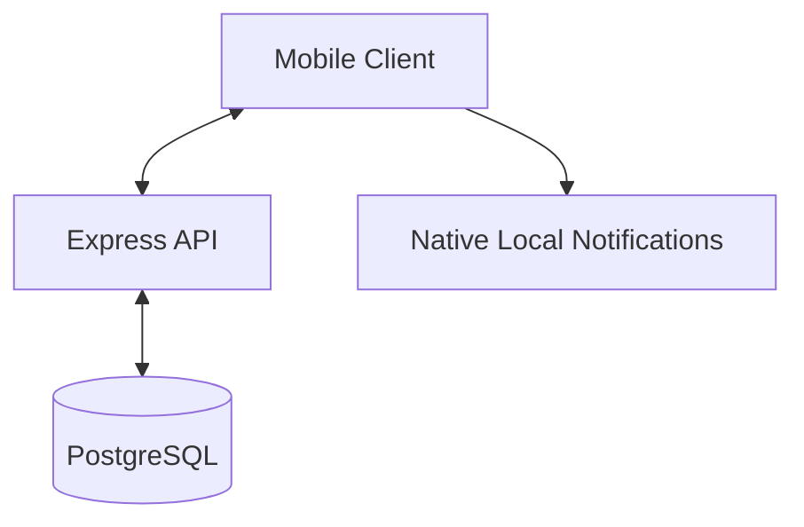

# Fitness Quest - Technical Design Document

## 1. Introduction
Fitness Quest is a gamified exercise app designed to build consistent habits through randomly scheduled "missions." It emphasizes small, achievable workouts over long gym sessions.

## 2. System Architecture

### 2.1 Overview
The system follows a standard Client-Server architecture with persistent storage and native notifications.

*   **Client**: React Native / Expo with TypeScript.
*   **Server**: Node.js / Express with TypeScript.
*   **Database**: PostgreSQL (Production storage for Users, Groups, Missions, and XP history).
*   **ORM**: Prisma (For type-safe database access).
*   **Notifications**: Native Local Notifications using `expo-notifications`.

### 2.2 Component Diagram

## 3. Core Functional Requirements

### 3.1 Exercise Scheduling & Mission Rotation
*   **Daily Reset**: At 00:00 local time, 3 new exercises are randomly selected and displayed on the Home Screen.
*   **Sequential Progress**: Only the current active mission is "colored" (active).
*   **Refresh Mechanic**: 12-hour cooldown per refresh.
*   **Availability Brackets**: User-defined window (e.g., 09:00-18:00) split into 3 equal blocks.
*   **"Complete Now" (Flex Mode)**: Users can override the schedule and complete missions early.

### 3.2 Mission System
*   **Strict Brackets**: Missions not completed by the end of their bracket are marked as `MISSED`.
*   **Snooze**: Missions can be snoozed exactly once for a 15-minute extension.
*   **Notifications**: Trigger native alerts when an exercise becomes required.

### 3.3 Gamification
*   **XP System**: Formula: `XP = (Exercises_Today * Days_Active) * (1 + (Current_Streak * 0.1))`.
*   **Streaks**:
    *   **Daily Streak**: Increments if at least 1 mission is completed per day.
    *   **Streak Reset**: If ALL 3 missions in a day are `MISSED`, Current Streak resets to 0.
*   **Leveling**: Level = `sqrt(TotalXP / 10)`.

### 3.4 Social & Community
*   **Groups**: Create/Join private groups for specific friend circles.
*   **Group Leaderboards**: Competitive ranks based on XP earned *since the group's creation*.
*   **Sharing**: Share group status and app invitations via native system share sheet.
*   **Friend Feed**: A stream of activity events.
*   *Note*: Real-time messaging and nudges have been removed to focus on core mechanics.

## 4. Data Model (PostgreSQL)

### 4.1 User
*   `id`: UUID (Primary Key)
*   `username`: String
*   `startTime`: String (e.g., "09:00")
*   `endTime`: String (e.g., "18:00")
*   `currentLevel`: Int
*   `totalXP`: Int
*   `currentStreak`: Int
*   `bestStreak`: Int
*   `lastCompletionDate`: DateTime

### 4.2 Group
*   `id`: UUID (Primary Key)
*   `name`: String
*   `ownerId`: UUID (Relation to User)
*   `createdAt`: DateTime

### 4.3 Mission
*   `id`: UUID (Primary Key)
*   `userId`: UUID (Relation to User)
*   `exerciseId`: String
*   `scheduledTime`: DateTime
*   `status`: String (PENDING, COMPLETED, MISSED)
*   `snoozeCount`: Int
*   `bracketStart`: String
*   `bracketEnd`: String

### 4.4 XPLog
*   `id`: Int (Primary Key)
*   `userId`: UUID (Relation to User)
*   `amount`: Int
*   `timestamp`: DateTime

## 5. API Endpoints

### User & Availability
*   `POST /api/missions/availability`: Update working hours.
*   `GET /api/missions/today`: Fetch today's missions and status.

### Missions
*   `POST /api/missions/:id/complete`: Mark as done.
*   `POST /api/missions/:id/snooze`: 15-minute extension.
*   `POST /api/missions/:id/refresh`: Swap exercise (cooldown applies).

### Social
*   `POST /api/social/groups`: Create new group.
*   `GET /api/social/groups`: List user's groups.
*   `GET /api/social/groups/:id/leaderboard`: Date-filtered group ranks.
