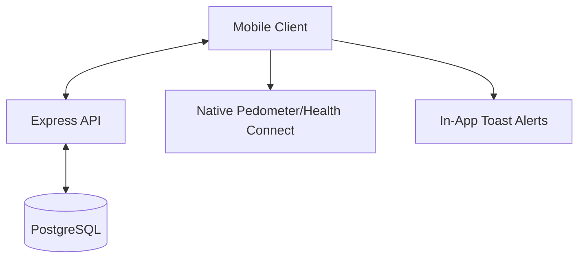

# Challenge Fit - Technical Design Document

## 1. Introduction
Challenge Fit is a gamified exercise app designed to build consistent habits through randomly scheduled "missions." It emphasizes small, achievable workouts over long gym sessions.

## 2. System Architecture

### 2.1 Overview
The system follows a standard Client-Server architecture with persistent storage and intelligent activity tracking.

*   **Client**: React Native / Expo with TypeScript.
*   **Server**: Node.js / Express with TypeScript.
*   **Database**: PostgreSQL (Production storage for Users, Groups, Missions, and XP history).
*   **ORM**: Prisma (For type-safe database access).
*   **Auth**: Passport.js with JWT and Social OAuth (Google/Facebook).
*   **Activity**: Native pedometer tracking via `expo-sensors`.

### 2.2 Component Diagram

## 3. Core Functional Requirements

### 3.1 Exercise Scheduling & Mission Rotation
*   **Daily Reset**: At 00:00 local time, 3 new exercises are randomly selected.
*   **Refresh Mechanic**: 12-hour cooldown per refresh.
*   **Availability Brackets**: User-defined window (e.g., 09:00-18:00) split into 3 blocks.

### 3.2 Mission System
*   **Strict Brackets**: Missions not completed by the end of their bracket are marked as `MISSED`.
*   **Catch-up Logic**: Missed goals can be automatically completed if daily step thresholds are met.
*   **Snooze**: Missions can be snoozed exactly once for a 15-minute extension.
*   **Intelligent Alerts**: In-app alerts are only triggered if the user has been stationary for 40+ minutes.

### 3.3 Rewards & Gamification (Phase 8)
*   **Tiered XP Rewards**:
    *   **Steps**: 5 XP per 2,000 steps used to complete a mission.
    *   **Manual Completion**: 7 XP per mission completed.
    *   **Active Response**: 10 XP per mission completed "On-Time".
    *   **Extra Mission**: 3 XP per bonus mission.
*   **Level Progression**:
    *   Formula follows a geometric progression ($3^n \times 11$):
        *   Level 1: 33 XP
        *   Level 2: 99 XP
        *   Level 3: 297 XP
        *   Level 4: 891 XP
        *   The progression is infinite and calculated on-the-fly based on total XP.
*   **Streaks**:
    *   **Daily Streak**: Increments if at least 1 mission is completed per day.
    *   **XP Bonus**: Users receive a daily bonus equal to their current streak count (e.g., 7-day streak = +7 XP bonus for that day).
    *   **Streak Reset**: If ALL 3 missions in a day are `MISSED`, Current Streak resets to 0.

### 3.4 Social & Community
*   **Groups**: Create/Join private groups for competitive leaderboards.
*   **Contact Integration**: Access device contacts to easily find and invite friends to groups.
*   **Group Leaderboards**: Ranks based on XP earned *since the group's creation*.
*   **Sharing**: Share group status and app invitations via native system share sheet.

## 4. UI/UX Standards
*   **Minimalist Aesthetic**: Clean text-based interface; no emojis used in UI labels or banners.
*   **Non-Intrusive Feedback**: Use Toast notifications for success messages (e.g., daily goal reached).

## 5. Data Model (PostgreSQL)

### 5.1 User
*   `id`: UUID (Primary Key)
*   `username`: String
*   `email`: String (Unique)
*   `password`: String (Hashed, optional)
*   `totalXP`: Int
*   `currentStreak`: Int
*   `bestStreak`: Int

### 5.2 Group
*   `id`: UUID (Primary Key)
*   `name`: String
*   `ownerId`: UUID (Relation to User)
*   `createdAt`: DateTime

### 5.3 Mission
*   `id`: String
*   `userId`: UUID (Relation to User)
*   `exerciseId`: String
*   `status`: String (PENDING, COMPLETED, MISSED)
*   `bracketStart`: String
*   `bracketEnd`: String
